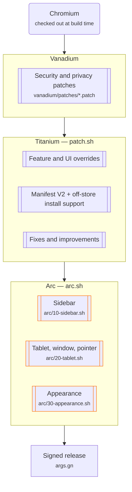

# Arc-style Browser for Android

[](LICENSE)
[](../../actions/workflows/build.yml)
[](../../actions/workflows/verify.yml)

A Chromium browser for Android tablets, arranged the way [Arc](https://arc.net)
arranges a browser: tabs in a sidebar down the side of the window rather than a
strip across the top, expanding when you point at it, with tab groups for
Spaces and tabs that retire themselves when you stop using them.

It is a fork of [Titanium Browser for
Android](https://github.com/jqssun/android-titanium-browser), which is itself
built on [Vanadium](https://github.com/GrapheneOS/Vanadium) by
[GrapheneOS](https://github.com/GrapheneOS). Chrome extensions, Manifest V2
support and off-store installs are inherited from Titanium; the security and
privacy hardening is inherited from Vanadium.

This is not Arc, is not affiliated with The Browser Company, and does not try
to pass for their product. It is Chromium set up to work the way Arc works.

## What it does

- **A sidebar instead of a tab strip.** Tabs run down the side of the window,
  collapsed to a rail until you point at it. Dragging a tab out of the rail
  moves it to another window, which on a tablet in split screen is how you pull
  a tab into the other pane.
- **Built for tablets, and for pointers.** Touch and trackpad both drive the
  same UI: hover expands the rail, right-click opens context menus, two-finger
  scroll moves the tab list, and keyboard shortcuts and focus traversal work
  throughout. The toolbar stays put on large screens rather than hiding on
  scroll.
- **Chrome extensions.** Manifest V2 and V3, from the Chrome Web Store, the
  other add-on marketplaces, or unpacked from local storage.
- **Chromium updates that stay cheap.** Nothing is vendored. Every patch
  declares the upstream code it depends on, so a Chromium bump is checked in
  seconds and fails loudly instead of silently dropping a feature.

[docs/ARC.md](docs/ARC.md) maps this against Arc feature by feature, including
the parts that are not reproducible.

## Usage

### Installing extensions

For Chrome extensions, open the [Chrome Web
Store](https://chromewebstore.google.com/), enable **Desktop site** from the
<kbd>⋮</kbd> menu, and install as normal.

For [Opera Add-ons](https://addons.opera.com/), [Microsoft Edge
Add-ons](https://microsoftedge.microsoft.com/addons/) and other marketplaces,
targeted User Agent changes may be needed. See [Titanium Extension for
Android](https://github.com/jqssun/android-titanium-extension).

To load an unpacked extension, open **Manage extensions** or
[`chrome://extensions`](chrome://extensions), turn on **Developer mode**,
choose **Load unpacked**, and pick the extension's folder in the file picker.
Manifest V2 extensions are supported. Loading may take a moment.

To run an extension in Incognito, open **Manage extensions**, find it, select
**Details**, and turn on **Allow in Incognito**.

### The sidebar

The sidebar is the default layout on any window at least 652dp wide. Switch
between it and a horizontal tab strip from the app menu, or by right-clicking a
tab. The collapsed and expanded states are remembered between launches.

### Debug URLs

[`chrome://chrome-urls`](chrome://chrome-urls) lists them.
[`chrome://flags`](chrome://flags) has the experiments, including
`#android-vertical-tabs` if you want the sidebar off entirely.

### WebRTC IP policy

Under <kbd>⋮</kbd> > **Settings** > **Privacy and security**. If WebRTC
misbehaves because IPs are shielded by default (Discord voice, for instance),
try **Default public interface only**, or **Default**.

## Implementation

Chromium is not forked. It is checked out pristine at build time and patched in
four layers, each on top of the last:



The Arc layer states, for each patch, the upstream code it attaches to and the
result it expects. A patch that no longer matches stops the build instead of
producing an APK quietly missing a feature — the failure mode of a bare
`sed -i`, and the reason Chromium bumps are usually painful.

That also makes the layer checkable without building anything:

```shell
tools/verify_patches.sh                # against the Chromium this repo targets
tools/verify_patches.sh 153.0.8000.0   # against a version you are considering
```

It downloads only the files the patches touch and reports each one. CI runs it
on every push, and again before the scheduled build, so a Chromium bump that
breaks a patch is caught in seconds rather than hours into a build.

See [docs/UPDATING.md](docs/UPDATING.md) for the update workflow and how to
re-anchor a patch that has broken.

> [!WARNING]
> This project only improves security and privacy where it can. For real
> protection on Android, use [GrapheneOS](https://grapheneos.org) with
> [Vanadium](https://vanadium.app), which also patches the system WebView and
> hardens the kernel and memory management at the OS level.

## Building

`build.sh` compiles on current Ubuntu and probably other Linux distributions.
It installs its dependencies, clones Chromium at the targeted version, applies
all four layers, and builds and signs `armeabi-v7a` and `arm64-v8a`. A local
build that only needs one device can build a single architecture:

```shell
ARCHS=arm64 ./build.sh
```

[docs/BUILDING.md](docs/BUILDING.md) covers hardware, building under WSL2, and
building on a NAS or second machine, along with the failures worth knowing
about in advance.

To build releases in CI, fork this repository and add your `base64`-encoded
`keystore.jks` and `local.properties` (holding `keyAlias`, `keyPassword` and
`storePassword`) to **Settings** > **Secrets and variables** > **Actions** as
`STORE_TEST_JKS` and `LOCAL_TEST_JKS`. Then run the **Build** workflow, with
`ubuntu-latest` for a GitHub-hosted runner or `self-hosted` for your own
hardware. Chromium is a large build; a hosted runner will struggle.

## Credits

This exists because of [Titanium Browser for
Android](https://github.com/jqssun/android-titanium-browser) by
[jqssun](https://github.com/jqssun), which contributed the extension support
this fork depends on, and
[Vanadium](https://github.com/GrapheneOS/Vanadium) by GrapheneOS, which
contributed the hardening underneath it. The vertical tab implementation is
Chromium's own. All credit goes to those authors and contributors.

Arc is a product of The Browser Company. This project is not affiliated with or
endorsed by them; it takes inspiration from their interaction design only.
